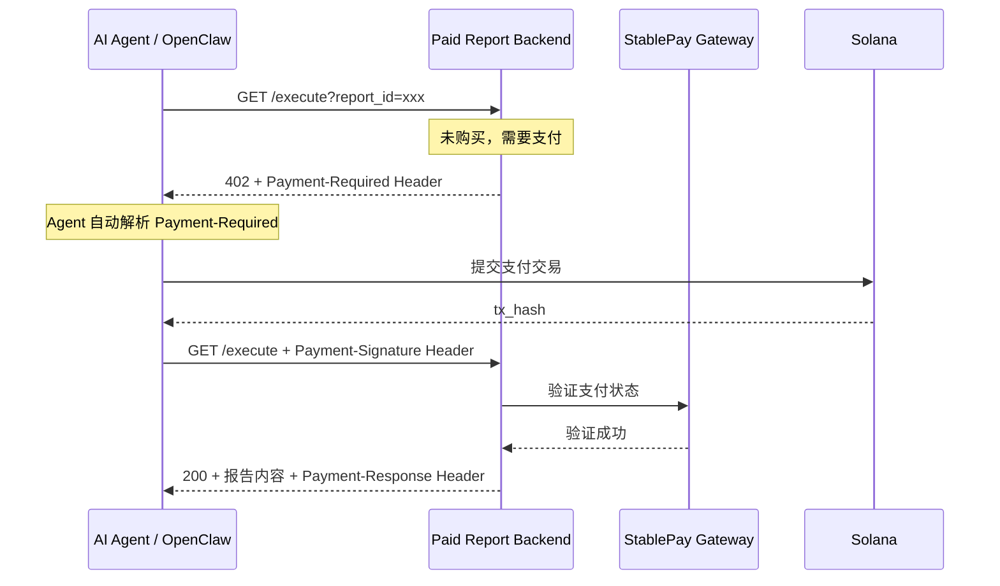

# x402 标准支付实现文档

本文档记录了 StablePay Paid Report Backend 对 [x402 协议](https://x402.org) 的实现细节。

## 1. 概述

### 什么是 x402

x402 是一个开放标准协议，用于机器对机器（M2M）的自动支付。它定义了 HTTP 402 Payment Required 状态码的标准化使用方式，使 AI Agent 能够自动化地完成付费资源的访问。

### 核心优势

- **自动化**：通用 SDK（如 `x402-fetch`）可自动处理支付流程
- **多链支持**：通过 `accepts` 数组支持多种区块链和代币
- **标准化**：统一的 Header 和响应格式，降低集成成本
- **可组合性**：服务可以无缝接入未来的 Agent 经济网络

## 2. 架构设计



## 3. 核心实现

### 3.1 402 响应格式（x402 标准）

当资源需要支付时，服务端返回：

```http
HTTP/1.1 402 Payment Required
Payment-Required: eyJ4NDAyVmVyc2lvbiI6MSwiYWNjZXB0cyI6W3sic2NoZW1lIjoiZXhhY3Qi...}
Accept-Payment: x402, stablepay-v1
Content-Type: application/json

{
  "x402Version": 1,
  "accepts": [
    {
      "scheme": "exact",
      "network": "solana:5eykt4UsFv8P8NJdTREpY1vzqKqZKvdp",
      "maxAmountRequired": "2000000",
      "payTo": "2kZGwkLnVdSxjjNueeUQmqBf3tRKMn7y1bbktRZkJWdR",
      "asset": "EPjFWdd5AufqSSqeM2qN1xzybapC8G4wEGGkZwyTDt1v",
      "description": "购买报告：AI Agent 岗位分析报告 2025",
      "resource": "/execute?report_id=ai-agent-job-2025",
      "maxTimeoutSeconds": 300,
      "extra": {
        "facilitatorUrl": "https://ai.wenfu.cn",
        "currency": "USDC",
        "reportId": "ai-agent-job-2025",
        "skillDid": "did:report:ai-agent-job-2025"
      }
    }
  ],
  "error": "Payment Required"
}
```

#### 关键字段说明

| 字段 | 类型 | 说明 |
|------|------|------|
| `x402Version` | number | 协议版本，当前为 1 |
| `accepts` | array | 支持的支付选项列表 |
| `accepts[].scheme` | string | 支付方案，支持 "exact"（精确金额） |
| `accepts[].network` | string | 区块链网络标识符 |
| `accepts[].maxAmountRequired` | string | 最大所需金额（代币最小单位，USDC 为 6 位精度） |
| `accepts[].payTo` | string | 收款地址 |
| `accepts[].asset` | string | 代币合约地址 |
| `accepts[].maxTimeoutSeconds` | number | 支付超时时间（秒） |
| `accepts[].extra` | object | 扩展信息，包含 facilitatorUrl 等 |

### 3.2 HTTP Headers

#### 请求 Headers

| Header | 说明 |
|--------|------|
| `Payment-Signature` | 支付凭证（Base64 编码的 JSON），包含签名、时间戳、nonce |

#### 响应 Headers

| Header | 说明 |
|--------|------|
| `Payment-Required` | Base64 编码的支付要求信息 |
| `Payment-Response` | 支付成功后的结算凭证 |
| `Accept-Payment` | 服务端支持的支付方式 |

### 3.3 支付金额计算

USDC 使用 6 位小数精度：

```javascript
// $2.00 USDC = 2,000,000 最小单位
const amountInMinorUnits = Math.round(2.00 * 1_000_000).toString();
// result: "2000000"
```

## 4. API 端点

### 4.1 获取报告列表

```bash
GET /reports
```

**响应**：
```json
{
  "ok": true,
  "reports": [
    {
      "id": "ai-agent-job-2025",
      "title": "AI Agent 岗位分析报告 2025",
      "description": "深入分析 2025 年 AI Agent 领域的岗位需求...",
      "price": "2.00",
      "currency": "USDC",
      "author": "StablePay Research",
      "tags": ["AI", "Agent", "求职", "行业分析"]
    }
  ],
  "total": 4
}
```

### 4.2 获取单个报告信息

```bash
GET /report?id={report_id}
```

### 4.3 执行购买（x402 核心接口）

```bash
GET /execute?agent_did={did}&report_id={report_id}
```

#### 场景 1：未购买（首次请求）

返回 402，包含 `Payment-Required` Header。

#### 场景 2：携带支付凭证重试

```bash
curl "http://127.0.0.1:8788/execute?agent_did=did:solana:...&report_id=ai-agent-job-2025" \
  -H "Payment-Signature: eyJzaWduYXR1cmUiOiJ..."
```

成功响应：
```http
HTTP/1.1 200 OK
Payment-Response: eyJ4NDAyVmVyc2lvbiI6MSwidHhJZCI6InR4XzEyMyIsInR4SGFzaCI6IjB4Li4uIiwic2V0dGxlZEF0IjoiMjAyNi0wNC0yNlQxMjowMDowMFoifQ==
Content-Type: application/json

{
  "ok": true,
  "product": "paid-report",
  "x402Version": 1,
  "access": {
    "agent_did": "did:solana:...",
    "report_id": "ai-agent-job-2025",
    "verified_by_backend": true,
    "verified_at": "2026-04-26T12:00:00Z",
    "access_token": "rpt_xxx"
  },
  "report": {
    "id": "ai-agent-job-2025",
    "title": "AI Agent 岗位分析报告 2025",
    "author": "StablePay Research",
    "tags": ["AI", "Agent", "求职", "行业分析"]
  },
  "content": {
    "format": "markdown",
    "text": "# AI Agent 岗位分析报告 2025..."
  }
}
```

## 5. 与 OpenClaw 集成

### 5.1 x402 响应解析

OpenClaw 插件已更新支持 x402 标准格式。`extractPaymentRequirement` 函数会自动识别并解析 x402 响应：

```typescript
// x402 响应解析示例
function extractPaymentRequirement(payload: any) {
  if (payload?.x402Version === 1 && Array.isArray(payload?.accepts)) {
    const accept = payload.accepts[0];
    const extra = accept?.extra || {};

    // 将 maxAmountRequired（6位精度）转换为小数
    const maxAmountRequired = accept?.maxAmountRequired;
    const minorUnits = BigInt(maxAmountRequired);
    const whole = minorUnits / 1_000_000n;
    const fraction = minorUnits % 1_000_000n;
    const price = fraction === 0n 
      ? whole.toString() 
      : `${whole}.${fraction.toString().padStart(6, "0")}`;

    return {
      skill_did: extra.skillDid,
      price: price,  // e.g., "2.00"
      currency: extra.currency || "USDC",
      payment_endpoint: extra.facilitatorUrl || "/api/v1/pay",
      // 保留 x402 元数据供后续使用
      _x402: {
        version: payload.x402Version,
        scheme: accept.scheme,
        network: accept.network,
        payTo: accept.payTo,
        asset: accept.asset,
      },
    };
  }
  
  // 向后兼容：支持旧格式
  // ...
}
```

### 5.2 自动支付流程

OpenClaw 插件可以自动处理 x402 支付：

```typescript
// 伪代码示例
async function handleX402Request(url: string, agentDid: string) {
  // 1. 首次请求
  let response = await fetch(`${url}?agent_did=${agentDid}&report_id=xxx`);
  
  // 2. 检查 402
  if (response.status === 402) {
    const paymentRequired = response.headers.get('Payment-Required');
    const paymentDetails = JSON.parse(atob(paymentRequired));
    
    // 3. 自动完成支付（调用钱包签名）
    const paymentSignature = await wallet.signPayment(paymentDetails);
    
    // 4. 重试请求，携带支付凭证
    response = await fetch(`${url}?agent_did=${agentDid}&report_id=xxx`, {
      headers: {
        'Payment-Signature': paymentSignature
      }
    });
  }
  
  // 5. 返回内容
  return response.json();
}
```

### 5.3 向后兼容性

OpenClaw 插件同时支持 x402 标准格式和传统格式：

```typescript
// 插件会自动检测响应格式
const requirement = extractPaymentRequirement(payload);

// 无论是 x402 格式：
// { x402Version: 1, accepts: [...] }

// 还是传统格式：
// { skill_did: "did:solana:...", price: "2.00", currency: "USDC" }

// 都会返回统一结构：
// { skill_did, price, currency, payment_endpoint }
```

这种设计确保了：
- 新服务可以直接采用 x402 标准
- 现有服务可以继续使用传统格式
- 客户端代码无需修改即可兼容两种格式

### 5.4 与传统方式的对比

| 特性 | 传统方式 | x402 标准 |
|------|----------|-----------|
| 集成复杂度 | 高（需要定制解析） | 低（通用 SDK） |
| 自动化程度 | 手动调用支付工具 | 全自动处理 |
| 多链支持 | 需单独适配 | 通过 `accepts` 自动选择 |
| 用户体验 | 多轮对话确认 | 无感知自动支付 |

## 6. 配置说明

### 环境变量

| 变量 | 默认值 | 说明 |
|------|--------|------|
| `PORT` | 8788 | 服务端口 |
| `GATEWAY_BASE_URL` | https://ai.wenfu.cn | StablePay 网关地址 |
| `FACILITATOR_URL` | https://ai.wenfu.cn | x402 Facilitator 地址 |
| `SELLER_ADDRESS` | - | 收款钱包地址（必需） |
| `STABLEPAY_API_KEY` | stablepay-dev-key | API 密钥 |
| `MERCHANT_PROOF_SECRET` | - | 访问令牌签名密钥 |

### 启动服务

```bash
cd paidReport-backend
npm install

# 配置环境变量
cp .env .env.local
# 编辑 .env.local 设置 SELLER_ADDRESS

npm start
```

## 7. 测试示例

### 7.1 获取报告列表

```bash
curl "http://127.0.0.1:8788/reports"
```

### 7.2 测试 402 响应

```bash
curl -i "http://127.0.0.1:8788/execute?agent_did=did:solana:C2vKSxoDErVhhLrKZvXHMmJcNKqKapx9MNQZrDab33vS&report_id=ai-agent-job-2025"
```

预期输出：
```http
HTTP/1.1 402 Payment Required
Payment-Required: eyJ4NDAyVmVyc2lvbiI6MSwiYWNjZXB0cyI6W3sic2NoZW1lIjoiZXhhY3Qi...
Accept-Payment: x402, stablepay-v1
Content-Type: application/json

{
  "x402Version": 1,
  "accepts": [...],
  "error": "Payment Required"
}
```

### 7.3 解码 Payment-Required Header

```bash
# 提取并解码 Header 内容
echo "eyJ4NDAyVmVyc2lvbiI6MSwiYWNjZXB0cyI6W3sic2NoZW1lIjoiZXhhY3Qi..." | base64 -d
```

## 8. 与行业标准对比

### 8.1 Nansen API

Nansen 的 x402 实现支持多链支付（Base、Solana），通过 `accepts` 数组让客户端选择。

### 8.2 FX Land

FX Land 添加了 `maxTimeoutSeconds` 和详细的资源描述，适合存储类服务。

### 8.3 我们的特色

- **StablePay 集成**：与现有的 StablePay 网关无缝衔接
- **多报告管理**：一个后端支持多种报告售卖
- **OpenClaw 兼容**：保持与 OpenClaw 插件的向后兼容

## 9. 常见问题

### Q: 为什么使用 `Payment-Required` Header 而不是 Body？

Header 可以让客户端在不解析 Body 的情况下快速识别支付要求，实现协议分层。

### Q: 如何支持多链支付？

在 `accepts` 数组中添加多个支付选项，客户端根据自身钱包能力选择。

### Q: Facilitator 的作用是什么？

Facilitator（支付中介）负责验证支付签名、提交链上交易、处理结算，让服务端无需直接对接区块链。

## 10. 参考资料

- [x402 Protocol Specification](https://x402.org)
- [Coinbase x402 Implementation](https://github.com/coinbase/x402)
- [Nansen API Documentation](https://api.nansen.ai)
- [StablePay Gateway API](https://ai.wenfu.cn/docs)

---

**文档版本**: 1.0  
**最后更新**: 2026-04-26  
**协议版本**: x402 v1
